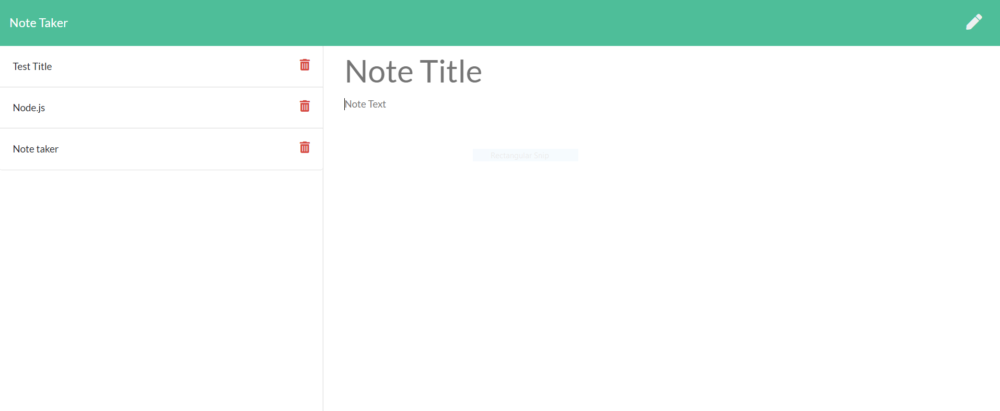

# note-taker
Note-taker application built using node express package  
[](https://opensource.org/licenses/MIT)

## User Story
```
AS A user, 
I WANT to be able to write and save notes,
I WANT to be able to delete notes I've written before,
SO THAT I can organize my thoughts and keep track of tasks I need to complete
```
## Description
Note-taker is a node.js application built using the node Express package, that can be used to write, save and delete notes. The application allows users to create and save notes, view previously saved notes as well as the ability to delete any of the previously saved notes. This application is especially useful for users that need to keep track of a lot of information, who tend to forget easily and are unable to recall something important. Being able to take persistent notes allows users to have written information available when needed. 

Application Development: 
Two different route files have been created within the routes folder:
- htmlRoutes.js handles the static html requests
- apiRoutes.js handles the dynamic API requests

## Table of Contents
* [Installation](#installation)
* [Usage](#usage)
* [Contributing](#contributing)
* [Questions](#questions)
* [License](#license)

## Installation
1. Pre-requirement is to install a command-line application and node version 14.15.0 or higher.
2. Open the terminal/command-line and open the directory where the project is downloaded. 
3. Enter the command 'npm install' to install all the required package dependencies.

## Usage
1. In the command line/terminal within the directory that the project is downloaded, invoke the application using the command 'node server.js' 
2. Access this URL in the browser (http://localhost:8080/) and  hit enter. The Home page of the note-taker application will be rendered. 
3. Click on the "Get started" button to view existing notes or create and save a new note. The resulting page will have a navbar that has a button on the right in the form of a pen icon, to create a new note. The page is further divided into 2 sections: the left sections displays any existing saved notes, along with a delete button next to it that allows the user to delete the corresponding note. The right section is where a user can create a new note.
4. To create and save a new note: Click on the pen icon in the navbar. Enter a note title and corresponding note text below it as indicated. A save button shows up on the navbar to the left of the pen icon, once a note title and note text are entered by the user. Click on that save button to save the note.
5. To view details of an existing saved note: The left section of the page displays the note titles of any existing saved notes. Once a newly entered note is saved, the new note title will also get populated to the list of existing notes in the left section. The user can click on the note title of the specific note that he wants to view the note text for. The corresponding note details are populated in the right section for the user to view.
6. To delete a note: In the left section of the page where the existing notes are listed, to the right of every note title is the delete button icon which can be used to delete the corresponsing note. The note disappears from the list as soon as the delete button is clicked.

## Contributing
This application has been individually developed by Jesal Mehta. If you are interested in fixing issues and contributing directly to the code base, you can do so according to the guidelines listed in the [Contributor Covenant](https://www.contributor-covenant.org/) industry standard.

## Questions
For any questions,
Here is my Github profile link: [JesalDM](https://github.com/JesalDM)  
You can also reach out to me directly at [jesaldmehta@gmail.com](mailto:jesaldmehta@gmail.com)

## License
This project is licensed under the terms of the MIT license.

## For Review
* Github Repository URL: https://github.com/JesalDM/note-taker
* Application demo: 
* Screenshot : 
* Deployed application Heroku URL: https://manage-notes.herokuapp.com/
